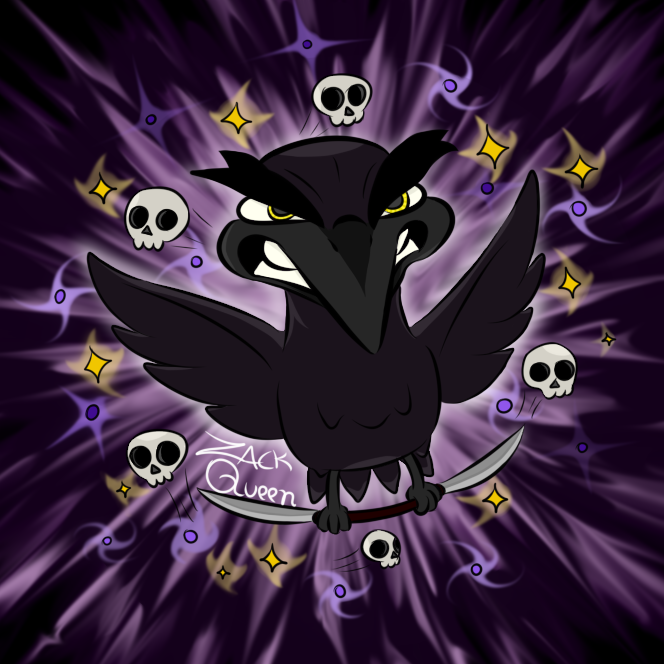

Estou estudando Front End com o Programa One da Oracle com parceria da Alura.
Tenho interesse no mundo tecnológico, principalmente no mercado Jogos digitais! Estou graduada na FATEC no curso de Jogos Digitais e tenho certificados em cursos de TI, Lógica, FrontEnd, AutoDesenvolvimento, Gestão Ágil e claro conhecimento em Ilustração e Animação.

Meu principal foco é me tornar uma Game Designer, e quero poder fazer jogos com meu conhecimento em Front End, por isso me interesso principalmente por tudo que envolva essa área. Espero poder ajudar com meu conhecimento atual, e estou disponível para conversar sobre o que for! Constantemente estudo e pratico minhas noções das áreas já citadas, com esperança de fazer criações que alegrem os usuários! 

### Tools and my stack:

                            

###  Let's Talk!?

  

###  GitHub Stats

<picture>
  <source media="(prefers-color-scheme: dark)" srcset="https://raw.githubusercontent.com/zack-queen/zack-queen/output/github-contribution-grid-snake-dark.svg">
  <source media="(prefers-color-scheme: light)" srcset="https://raw.githubusercontent.com/zack-queen/zack-queen/output/github-contribution-grid-snake.svg">
  
</picture>
  

